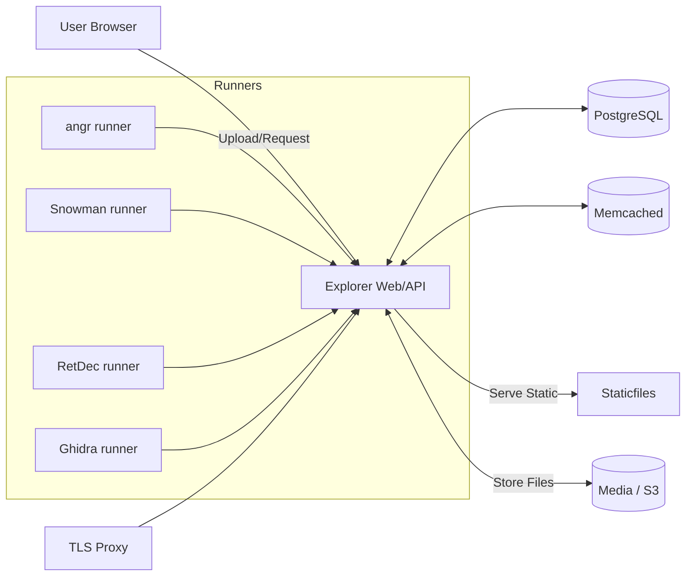

# DeVul — Project Report

## 1. Introduction
- Purpose: A web frontend to compare outputs from multiple decompilers on uploaded binaries.
- Value: Simplifies reverse engineering experiments, education, and tool comparison by centralizing uploads, queueing, and results.
- Repo: https://github.com/jasstej/DeVulDecompiler

## 2. System Overview
- Frontend/API: Django 3.2 + Django REST Framework (DRF) in `decompiler_explorer/` and `explorer/`.
- Workers: Dockerized runner containers per decompiler poll the server for jobs and post results.
- Storage: Local filesystem (`media/`) by default or S3-compatible object storage in production.
- Infra: Docker Compose (dev) / Docker Swarm + Traefik (prod). Postgres + Memcached.

### 2.1 Architecture Diagram (Mermaid)


## 3. Data Model
Defined in `explorer/models.py`.
- `Binary`: Uploaded file, content hash, featured flags.
- `Decompiler`: name, version, revision, url, heartbeat, featured.
- `DecompilationRequest`: queue entries per `(binary, decompiler)`; includes `last_attempted`.
- `Decompilation`: result or `error`, `analysis_time`; unique per `(binary, decompiler)`.
- Health: Decompiler is "healthy" if `last_health_check` < 1 minute old; queue targets only healthy latest versions.

### 3.1 Key Constraints
- Unique `(name, version, revision, url)` for `Decompiler`.
- Unique `(binary, decompiler)` for `Decompilation` and `DecompilationRequest`.
- `Decompilation` must have either `decompiled_file` or `error` (check constraint).

## 4. API Design
Routes defined in `decompiler_explorer/urls.py` and viewsets in `explorer/views.py`.
- `POST /api/binaries/`: upload a binary (anonymous allowed; throttled).
- `GET /api/binaries/{id}/download/`: download original binary.
- `GET /api/binaries/{id}/decompilations/`: list results for a binary.
- `GET /api/decompilers/`: list decompilers; `POST` used by workers to register.
- `GET /api/decompilers/{id}/health_check/`: worker heartbeat.
- `GET /api/decompilation_requests/?decompiler={uuid}`: worker polls for next job (locks via `last_attempted`).
- `POST /api/decompilation_requests/{id}/complete/`: submit result or error.
- `GET /api/queue`: queue stats (JSON or HTML); HTML routes: `/`, `/faq`, `/about`, `/queue`.

### 4.1 Permissions & Throttling
- Default DRF permissions require auth, but views override:
  - `Binary.create`: `AllowAny` with `AnonBurstRateThrottle` (6/min) and `AnonSustainedRateThrottle` (60/hour).
  - `Decompilation.retrieve/list/download`: `AllowAny`.
  - Admin-only for mutations elsewhere.
- Workers bypass throttle (checked via `X-AUTH-TOKEN`, see `decompiler_explorer/utils.py`, `throttle.py`).

## 5. Processing Workflow

### 5.1 Sequence Diagram (Upload → Decompile → Result)
```mermaid
sequenceDiagram
  participant U as User
  participant API as Explorer API
  participant Q as Queue (DB)
  participant R as Runner (e.g., Ghidra)
  participant S as Storage (Media/S3)

  U->>API: POST /api/binaries (file)
  API->>S: Store file
  API->>Q: Enqueue requests for healthy decompilers
  R->>API: GET /api/decompilation_requests?decompiler={id}
  API-->>R: Next request (binary URL, extend_timeout)
  R->>API: GET binary download URL
  R->>R: Run decompile_*.py under limits
  R->>API: POST /complete (file or error; analysis_time)
  API->>S: Store result file (if present)
  API-->>U: Results visible under /binaries/{id}/decompilations
```

### 5.2 Time/Resource Limits
- Runner parameters control per-job limits (`--timeout`, `--extended-timeout`, memory soft/hard via RLIMIT_AS).
- Featured binaries can extend timeout (driven by `extend_timeout`).

## 6. Runners
- Common loop in `runners/decompiler/runner_generic.py`:
  - Discover `name/version/revision/url` from the script via `--name/--version/--url`.
  - Register or reuse `Decompiler`; heartbeat every 10 seconds.
  - Poll requests, download binary, run child decompiler with bash `timeout`, memory limits, and stdin piping; submit results.
- Example (Ghidra) in `runners/decompiler/decompile_ghidra.py`:
  - Uses Ghidra headless (`support/analyzeHeadless`) with a provided `DecompilerExplorer.java` post-script; Java 21 JDK included in the image.
  - Reads binary from stdin, writes output to a temp file, prints to stdout.

## 7. Deployment

### 7.1 Development (Docker Compose)
Files: `docker-compose.yml`, `docker-compose.dev.yml`, `Dockerfile.dev`, `entrypoint.sh`.
- Start core services and runners:
```zsh
pipenv install
python scripts/dce.py init

docker compose -f docker-compose.yml -f docker-compose.dev.yml up -d explorer database memcached
docker compose -f docker-compose.yml -f docker-compose.dev.yml up -d angr snowman retdec ghidra
open http://127.0.0.1:8000
```
- Live code mounts for quick iteration (`explorer/`, `templates/`, `static/`, etc.).

### 7.2 Production (Docker Swarm + Traefik)
Managed by `scripts/dce.py`:
```zsh
python scripts/dce.py start --prod --replicas 2 --acme-email=<your email>
# S3 mode:
python scripts/dce.py start --prod --replicas 2 --acme-email=<your email> --s3 --s3-bucket=<bucket> --s3-endpoint=<endpoint> --s3-region=<region>
```
- Traefik provides TLS, routing, request size limits.
- Secrets: `secrets/db_superuser_pass`, `secrets/worker_auth_token`.

## 8. Security Considerations
- Worker auth via `X-AUTH-TOKEN` hashed in `settings/docker.py`.
- Public throttles for uploads; workers bypass throttles.
- Isolation via containers; time/memory limits on decompiler processes.
- Optional S3 signed URLs for downloads when configured.

## 9. Extensibility: Adding a Decompiler
1) Add `decompile_<name>.py` that supports `--name/--version/--url` and stdin→stdout processing.
2) Add a new build stage in `runners/decompiler/Dockerfile`.
3) Add a service in `docker-compose.yml` (copy another runner block).
4) Build and start just that service:
```zsh
docker compose -f docker-compose.yml -f docker-compose.dev.yml up --build -d <name>
```

## 10. Operations & Troubleshooting
- Logs:
```zsh
docker logs -f decompiler-explorer-explorer-1
docker logs -f decompiler-explorer-<runner>-1
```
- Verify runners:
```zsh
curl -fsS http://127.0.0.1:8000/api/decompilers/
```
- Common fixes:
  - Static/media permissions: `chown/chmod` on host then restart explorer.
  - Increase angr timeouts via `DECOMPILER_TIMEOUT_ANGR`, `DECOMPILER_EXTENDED_TIMEOUT_ANGR`.
  - Full clean restart steps in `docs/GETTING_STARTED.md`.

## 11. File Map & Pointers
- Config: `decompiler_explorer/settings/base.py`, `decompiler_explorer/settings/docker.py`, `decompiler_explorer/urls.py`
- App: `explorer/models.py`, `explorer/views.py`, `explorer/serializers.py`, `explorer/permissions.py`
- Runners: `runners/decompiler/runner_generic.py`, `runners/decompiler/decompile_*.py`
- Deploy: `docker-compose*.yml`, `Dockerfile*`, `entrypoint.sh`, `scripts/dce.py`
- Docs: `README.md`, `docs/GETTING_STARTED.md`

## 12. Future Work
- Multi-version results per decompiler.
- Richer UI diffing between outputs.
- Per-user quotas and API keys.
- Fine-grained per-runner resource policies and metrics.

## 13. Export to PDF
- Pandoc (requires LaTeX for best results):
```zsh
pandoc -s docs/PROJECT_REPORT.md -o ProjectReport.pdf
```
- VS Code: install “Markdown PDF” extension, open the file, then Command Palette → “Markdown PDF: Export (pdf)”.

